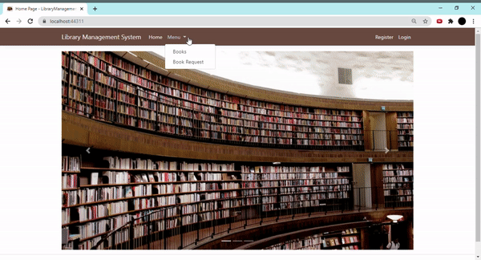
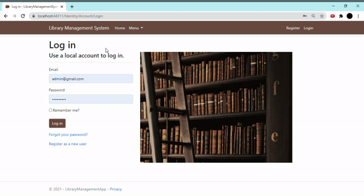

# Library Management System

This is an Asp.NET Core MVC project. 
I used Microsoft SQL Server in this project for database.

## Images from project:

Home page:

You can list all books and do search on books without login.

But if you want to do book request then you should log in.

If you have an admin account then you can reach Author page. Here you can add new author or edit on exist author and delete them.

Same way if you are an admin you can add new books, edit and delete them.

If you are an admin you can add new user or new admin but if you don't an admin then you can't add a new admin. This feature is only for admin.

